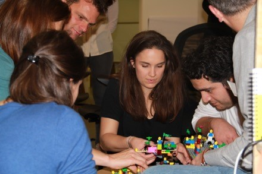
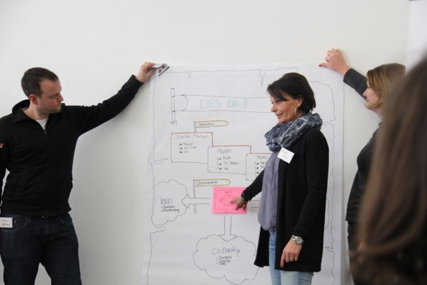
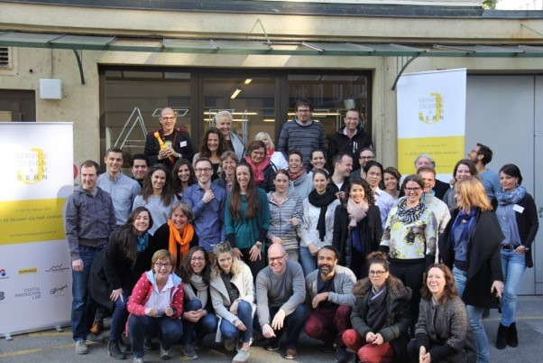

+++
title = "Service Design Jam Bern"
date = "2017-03-04"
description = "Der Service Design Jam hat das Ziel, sich weltweit gemeinsam einer unerwarteten Herausforderung zu stellen und diese innerhalb von 48 Stunden zu erkunden, um auf diese Weise einige Prototypen zu entwickeln, mit deren Hilfe die Welt in 48 Stunden verändert werden konnte."
image = "service-jam.jpg"
author = "Daniel Osterwalder"
comments = true
tags = [ "Coworking" ]
+++

  

    <iframe class="embed-responsive-item" src="https://www.youtube.com/embed/9uqIkhLZ1FA?rel=0" frameborder="0" allowfullscreen></iframe>
  

Noch etwas erschöpft, sicher auch müde und doch sehr neugierig und gespannt und mit viel Energie treffen am Sonntag, 19. Februar 2017, morgens um 8 Uhr 30 die ersten Jammer/innen im Coworkingspace Effinger ein. Erschöpft und müde von den vorangegangenen zwei Tagen Service-Design Thinking, gespannt und neugierig darauf, ob sie es bis am Nachmittag noch schaffen werden, den Prototypen ihrer Idee und ihres Konzepts noch einmal so zu überarbeiten, dass er bei ihren Kunden auch tatsächlich ankommt und tatsächlich mit viel Energie und Überzeugung, dass es durchaus möglich ist, einen ersten Prototypen sehr rasch zu überarbeiten und weiter zu entwickeln.

## Jam, Jammer/innen, Design Thinking

Aber genau: Jam, Jammer/innen, Design Thinking – was ist das denn nun?

Vor genau sechs Jahren entfachten Adam Lawrence und seine Kolleg/innen in San Francisco ein erstes Mal das Feuer des Global Service Jam. Ihr Ziel: Sich mit vielen Gleichgesinnten in Sachen Innovation und Veränderungen gleichzeitig und weltweit gemeinsam einer unerwarteten und speziellen Herausforderung in Form einer assoziationsoffenen Frage zu stellen und diese innerhalb von 48 Stunden zu  erkunden, auseinanderzunehmen, zu vertiefen und auszuloten, um auf diese Weise und eben im Sinne des Service-Design Thinking einige Prototypen zu entwickeln, mit deren Hilfe die Welt in 48 Stunden verändert werden konnte. Während sich 2011 bereits Teams in sieben Städten für das spannende Vorhaben erwärmen konnten, waren es heuer – unser Service-Design Thinking Jam in Bern eingeschlossen – Teams in 105 Städten in 45 Ländern mit insgesamt rund 2500 Teilnehmer/innen, die wild entschlossen sich der bis am ersten Abend kurz vor 19 Uhr noch unbekannten Frage stellten.

  Teambildung mit LEGO SERIOUS PLAY

## Die Herausforderung des Jam

Eben: Die Frage – oder worum geht es eigentlich? Der Global Service Jam dreht sich unter anderem auch darum, Menschen auf vielfältige Weise in die Höhen und Tiefen des Service-Design Thinking einzuführen oder jene, die hier bereits in flottem Flug unterwegs sind, in neuen Rollen zu begleiten, um immer wieder von Neuem zu entdecken, wie bedeutsam es ist, in kleinen Schritten und vielen Iteration aus ersten Ideen greifbare und sichtbare Lösungen zu entwickeln, die mögliche Kund/innen auch immer gleich testen können.
Während vor zwei Jahren eine Skizze des berühmten Himmel-und-Hölle auf den ersten Blick eine recht grosse Herausforderung darstellte, der sich sowohl vor Ort als auch weltweit die 5er bis 6er Teams stellten, nur um auf unterschiedlichste Art und Weise zu neuen Lösungen zu gelangen, so blieb beim ein oder der anderen der Mund etwas länger offen, als das Geheimnis um den diesjährigen Challenge gelüftet wurde:

> Hello? lo? o? o.

Klar können Menschen mit wenig Phantasie und wohl eher eingeschränktem Blickwinkel die Ausgangslage und den Jam als „Leerlaufübung par Excellence“ und „Hobby Dilettantenclub“ interpretieren. Die sechs Teams im Effinger, die von kundigen Coaches begleitet und unterstützt wurden, stellten sich jedoch mit sehr viel erfrischendem Humor, viel Kreativität und Erfindergeist der Herausforderung und entwickelten in mehreren Schritten Prototypen zu neuen oder veränderten Dienstleistungen wie eine neue Treppenhausbegegnungsdienstleistung mit den „Stairwell Moments, eine Art offenes und nicht institutionalisiertes offenes Ohr für alles Mögliche in Form beweglicher „Story seats“ oder etwa ein „Shake away from happiness“ und zeigten damit, wie weit das Feld des Entdeckens und Forschens sein kann (auch jenes Feld des eigenen Mindsets), wenn man sich mit einer Art Anfängergeist einer neuen Frage stellt.

  Prototypen vorstellen und gleich auch testen

Und, wer hat gewonnen? Genau darum geht es nicht! Nicht darum, den besten, tollsten und was auch immer Prototypen entwickelt zu haben oder etwa zu gewinnen. Auch nicht darum, das schnellste Team gewesen zu sein oder genau die richtige Antwort gefunden zu haben (weil es eine derartige Antwort ja nicht gegeben hat und wie unsere eigene Erfahrung zeigt, wenn wir offenen Sinns durch die Welt gehen, in vielem gerade auch Alltäglichen sowieso nicht gibt). Vielmehr ging es darum, viel Freude und Spass zu entwickeln, die eigene Offenheit anzurühren, sich mit anderen und teilweise gänzlich unbekannten Menschen über auch nicht gar so einfache Themen auszustauschen und gleichwohl immer auch mit den Händen am eigenen Prototypen zu arbeiten, um eben zu lernen, mit den Händen zu denken. Darum: Der nächste Global Service Jam kommt bestimmt – und mit recht hoher Sicherheit werden wir auch 2018 den Raum dafür schaffen und halten für den Service Design Jam Bern.

  Teilnehmer/innen, Coaches, Orga- und Cateringteam des Jam 2017 samt unseren Sponsoren

