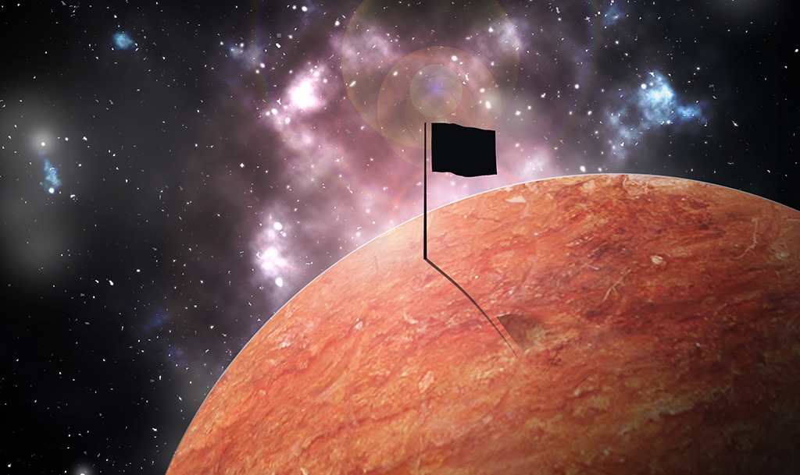

+++
title = "Effinger Open Debate: Mars-Kolonisierung - Utopisch oder visionär?"
description = "Ist die Mars-Kolonisierung eine Projektionsfläche aus Science-Fiction, Literatur und Kunst, eine Utopie für Nerds oder kann sie Impulse für neues menschliches Zusammenleben (Coworking, Coliving, agile Organisationsformen) aber auch für die wissenschaftliche Forschung und ökonomisch-technologische Entwicklungen liefern?"
startdate = 2018-11-28T19:30:00Z
enddate = 2018-11-28T21:30:00Z
categories = [ "Community" ]
location = "Effinger"
image = "mars.jpg"

registration = false
+++

## Gäste

- Pierre Brisson, Mars Society Switzerland
- Prof. Dr. Oliver Ullrich, Weltraummedizin, UZH
- Prof. Dr. Kathrin Altwegg, Space Research & Planetary Sciences, UNIBE
- Prof. Dr. Marcel Egli, Weltraummedizin, HSLU
- Renato Krpoun, Leiter Abteilung Raumfahrt SBFI
- Nationalrat Felix Müri für ein Grusswort der WBK

### Moderation und Live-Visualisierung

- [Daniel Osterwalder](https://www.visualdynamics.ch/)  

Moderation und Live-Visualisierung: Daniel Osterwalder, Visual Dynamics

## Inhalt

Damit die Menschheit vor sich selbst gerettet werden kann, träumt der Unternehmer und Visionär Elon Musk schon lange von bemannten Flügen auf den Mars und dessen Kolonisierung.  Mit seiner Firma SpaceX kommt er dieser Vision mit konkreten Entwicklungen im Bereich Raketentechnologie Stück für Stück näher. Damit haben er und andere Pioniere auch eine neue Ära der Raumfahrt eingeläutet. Die einen loben diese persönlichen und visionären Initiativen, die anderen kritisieren jedoch auch die Ökonomisierung und Privatisierung des Weltraums. Weltraumbergbau, Weltraumtourismus, Raketenrecycling, Minisatelliten und Satellitennetzwerke sind die Stichworte.

Nichtsdestotrotz werden die Mars-Pläne von vielen als Spinnerei von Milliardären abgetan. Zurecht lässt sich fragen, wieso brauchen wir den Planeten Mars? Ist die Mars-Kolonisierung eine Projektionsfläche aus Science-Fiction, Literatur und Kunst, eine Utopie für Nerds oder kann sie Impulse für neues menschliches Zusammenleben (Coworking, Coliving, agile Organisationsformen) aber auch für die wissenschaftliche Forschung und ökonomisch-technologische Entwicklungen liefern?

Tatsächlich, bei näherem Hinsehen wirft die Kolonisierung Fragen des politischen und gesellschaftlichen Zusammenlebens auf. Wer hat Anrecht auf den Planeten Mars? Wie würde man eine Community aufbauen auf dem Mars, was wird Arbeit auf dem Mars bedeuten und wer würde sich überhaupt auf dem Mars niederlassen? Was würde dies physiologisch und psychologisch mit dem Menschen machen? Was für Staats- und Demokratieformen braucht es unter solchen Verhältnissen und wie kann eine Geopolitik definiert werden, die sich jenseits der Erde abspielt? Ist die Mars-Kolonisierung eine einfache Wiederholung der Kolonialisierung Amerikas oder lassen sich hier komplett neue rechtliche, soziale, technologische und politische Konzepte erproben?

Fragen über Fragen, die in unserer Open Debate vielschichtig, kontrovers und inspirierend diskutiert werden sollen. Wir freuen uns auf euren Besuch und eure Meinung.
