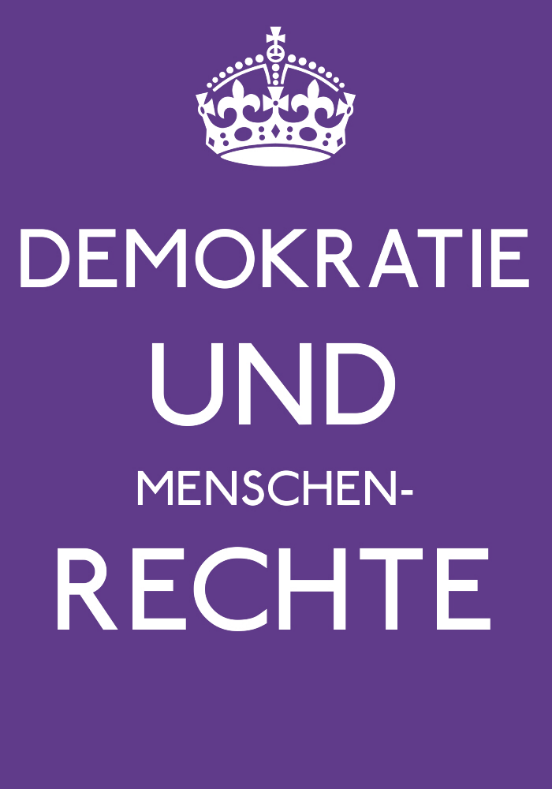

+++
title = "Open Debate: Demokratie und Menschenrechte"
description = "Demokratie und Menschenrechte – Gegensätze, Spannungen oder Gleichursprünglichkeit?"

startdate = 2017-09-11T19:30:00Z
enddate = 2017-09-11T21:30:00Z
categories = [ "Community" ]
location = "Effingerstrasse 10, Bern | Raum Grosse Schanze 1. OG"
address_link = "https://www.google.ch/maps/place/Effinger+-+Kaffeebar+%26+Coworking+Space/@46.94604,7.4336198,17z/data=!3m1!4b1!4m2!3m1!1s0x478e39bf613a53f7:0x30f7464656fbe3b2"

image = "demokratie-menschenrechte.png"
+++

## Gegensätze, Spannungen oder Gleichursprünglichkeit?

Im Rahmen aktueller Debatten zur EMRK, allgemein zum Thema Völkerrecht und Menschenrechte, aber auch wenn es um direkte Demokratie, Souveränität oder Selbstbestimmung geht, wird fast von allen Lagern das Gegensätzliche zwischen den Konzepten Demokratie und Menschenrechten betont.

Auf der einen Seite herrscht die Angst vor einer Mehrheitsdiktatur, auf der anderen dominieren Ängste vor Fremdbestimmung. Gleichzeitig gebietet die Kunst des kritischen Denkens Dogmen, vorherrschende Denkmuster und Paradigmen zu hinterfragen. Dies gilt nicht nur für die Volkssouveränität oder eine ungebändigte Volks- oder Mehrheitsherrschaft, sondern muss genauso auch für Völkerrecht und Menschenrechte gelten. So sprechen heute viele namhafte Akademiker von einer Gefahr der Trivialisierung und Inflation der Menschenrechte. Internationales Recht wird beispielsweise auch als Haupttreiber innerstaatlichen Überregulierung und Freiheitsverlusten betitelt. Umgekehrt lebt unsere Demokratie grundlegend von individuellen Rechten und von Freiheitsrechten.

Sind dies wirklich Gegensätze oder einfach nur Spannungen, die ausgeglichen und moderiert werden müssen und können? Oder gehören Demokratie und Menschenrechte nicht historisch und ideell zusammen als zwei Seiten derselben Medaille?

### Infos zum Event

Ort: Effinger Kaffeebar & Coworking Space, Raum «Grosse Schanze» 1. OG

Trägerschaft: [Effinger Community](https://www.effinger.ch/community/) und [Forum Demokratie und Menschenrechte](https://www.facebook.com/Forum-Demokratie-und-Menschenrechte-669507219864337/)

Podiumsteilnehmer:

-	Prof. Dr. und Nationalrat Hans-Ueli Vogt, Lehrstuhl für Privat- und Wirtschaftsrecht UZH
-	Prof. Dr. Francis Cheneval. Ordinarius Politische Philosophie UZH
-	Robert Nef, Liberales Institut
-	Prof. Dr. Andreas Kley, Lehrstuhl für öffentliches Recht, Staats- und Rechtsphilosophie UZH

Moderation und Live-Visualisierung: Daniel Osterwalder ([Visual Dynamics](http://www.visualdynamics.ch/visual.html))

*Kollekte*
